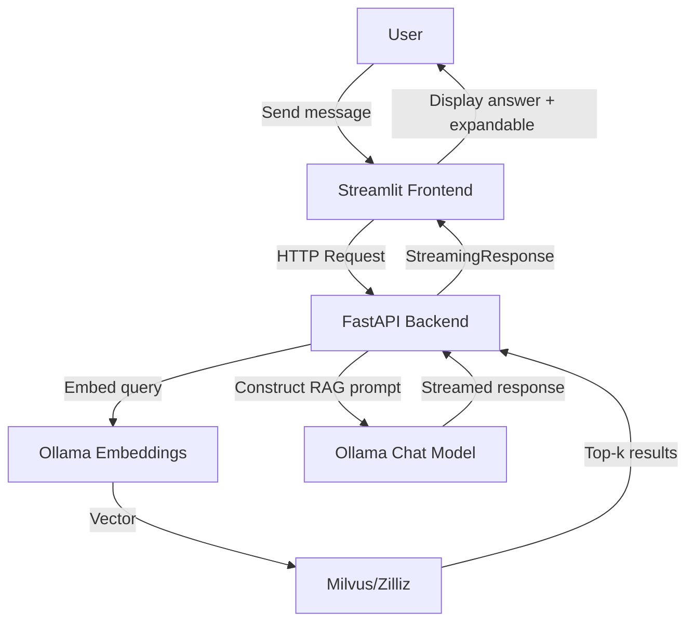

# LangGraph RAG Ollama

A Retrieval-Augmented Generation (RAG) chatbot built with **LangGraph**, **Ollama** for embeddings and LLM, **Milvus/Zilliz** for vector search, and **Streamlit** for frontend chat interaction.

## 🚀 Features

- **Streaming chat** support
- **Retrieval-Augmented Generation (RAG)** for context-aware answers
- **Milvus/Zilliz** as vector store
- **Ollama** Qwen3 embeddings & LLM
- **FastAPI** backend
- **Streamlit** frontend with expandable `<think>` sections

---

## 📦 Installation

### 1️⃣ Clone the repository
```bash
git clone https://github.com/asrulsibaoel/langgraph-rag-ollama.git
cd langgraph-rag-ollama
```

### 2️⃣ Create and activate environment
Using Conda:
```bash
conda create -n langchain python=3.12 -y
conda activate langchain
```
Or using venv:
```bash
python -m venv .venv
source .venv/bin/activate  # Linux/Mac
.venv\Scripts\activate     # Windows
```

### 3️⃣ Install dependencies
```bash
pip install -r requirements.txt
```

### 4️⃣ Set environment variables  
Create a `.env` file in the root directory:
```env
MILVUS_HOST=in03-xxxxxxxxxxxxxx.serverless.gcp-us-west1.cloud.zilliz.com
MILVUS_PORT=443
ZILLIZ_API_KEY=your_zilliz_api_key
OLLAMA_HOST=http://localhost:11434
OLLAMA_EMBED_MODEL=qwen3:8b
OLLAMA_CHAT_MODEL=qwen3:8b
```

---

## ▶️ Running the Application

### Start backend (FastAPI)
```bash
cd backend
bash run_backend.sh
```
Backend will run on:
```
http://localhost:8000
```

### Start frontend (Streamlit)
```bash
cd frontend
streamlit run app.py
```
Frontend will run on:
```
http://localhost:8501
```

---

## 🗂 Project Structure
```
langgraph-rag-ollama/
│
├── backend/
│   ├── routes/                # FastAPI routes
│   ├── services/              # Business logic
│   ├── run_backend.sh         # Run script for backend
│
├── frontend/
│   ├── app.py                  # Streamlit UI
│
├── requirements.txt
├── README.md
└── .env.example
```

---

## 🔄 System Flow



---

## 🛠 Troubleshooting
- **405 Method Not Allowed** → Make sure frontend uses `POST` for streaming and matches backend route.
- **Metric type not match** → Ensure Milvus collection uses `COSINE` if embeddings are normalized.
- **Slow queries** → Batch inserts and enable index creation in Milvus.

---

## 📜 License
MIT License © 2025 Asrul Sibaoel
